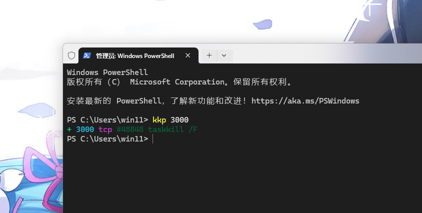
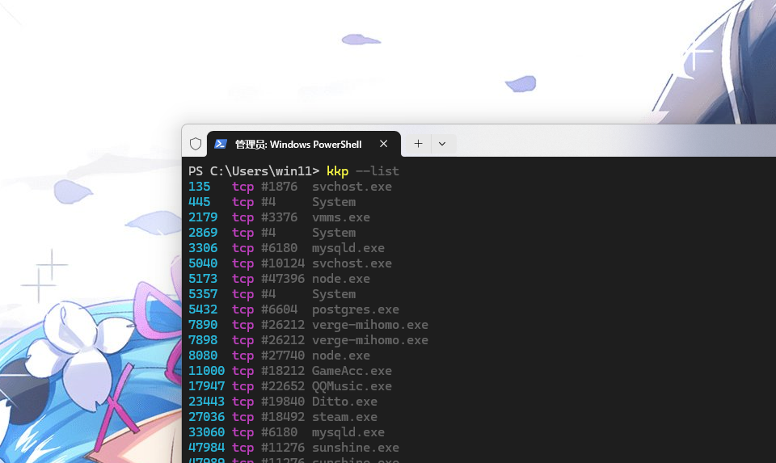

# kkp

Kill processes by port. Fast.



## Install

```bash
npm i -g kkp
```

## Usage

```bash
kkp 3000              # kill port 3000
kkp 3000 5173         # kill multiple
kkp --list            # list all listeners
kkp                   # interactive TUI
```

<details>
<summary>More screenshots</summary>

**List all listeners**



**Interactive TUI**


</details>

## Why kkp?

- **Fast** — uses `ss` on Linux, `lsof` on macOS, `netstat` on Windows
- **Safe** — protects system processes, requires `--force` to override
- **Simple** — one command, zero config, single dependency

## Options

```
--list, -l       list listeners
--json, -j       JSON output
--dry-run        preview without killing
--force, -f      kill protected processes
--tcp / --udp    filter by protocol
```

## License

MIT